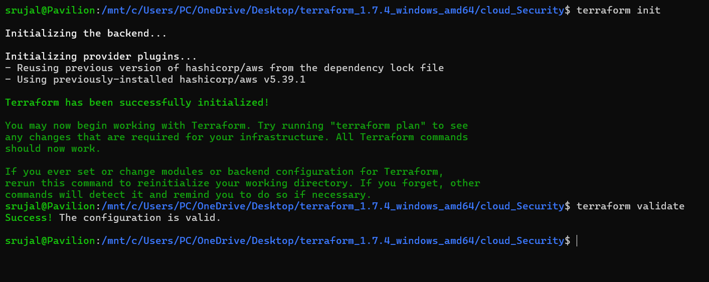
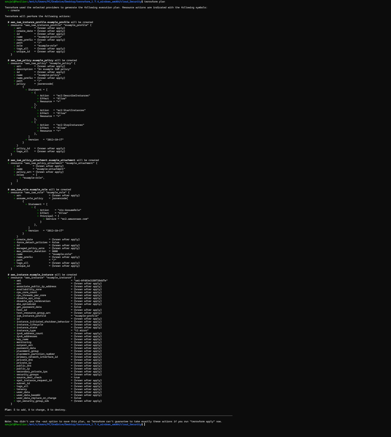
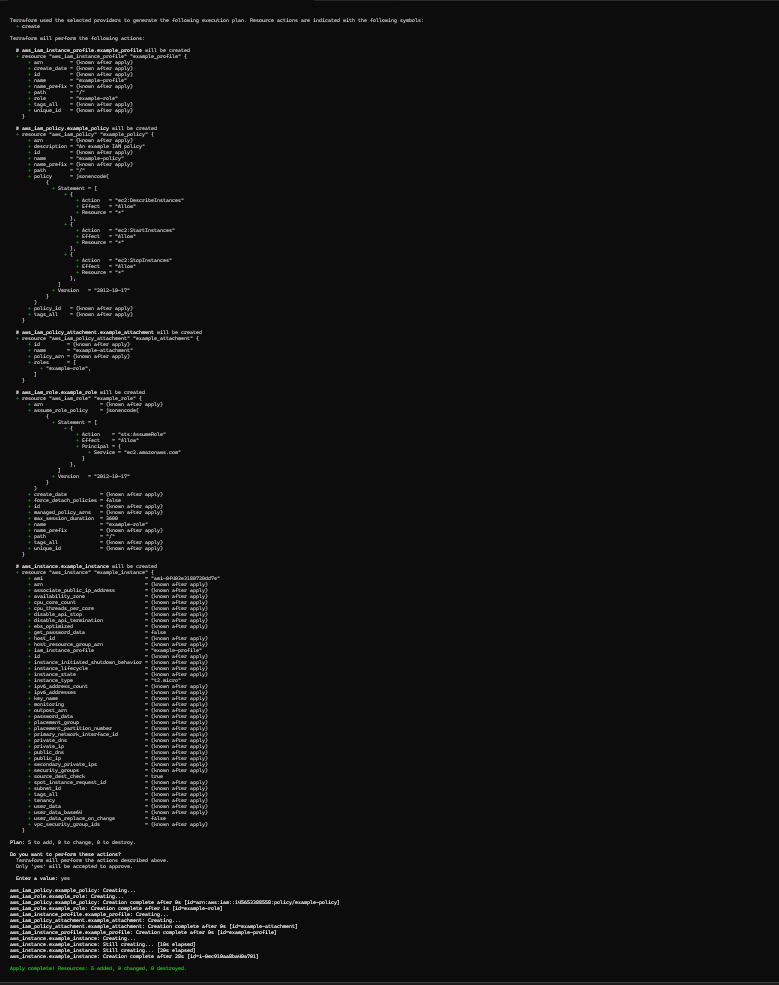
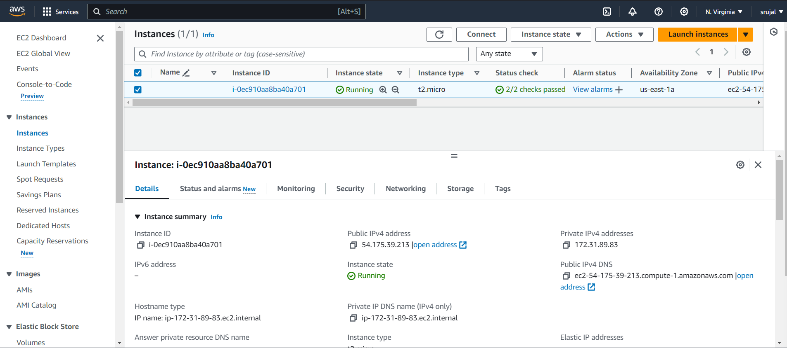
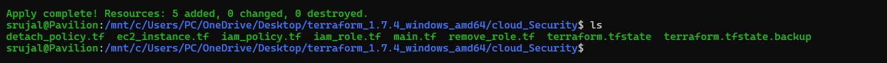
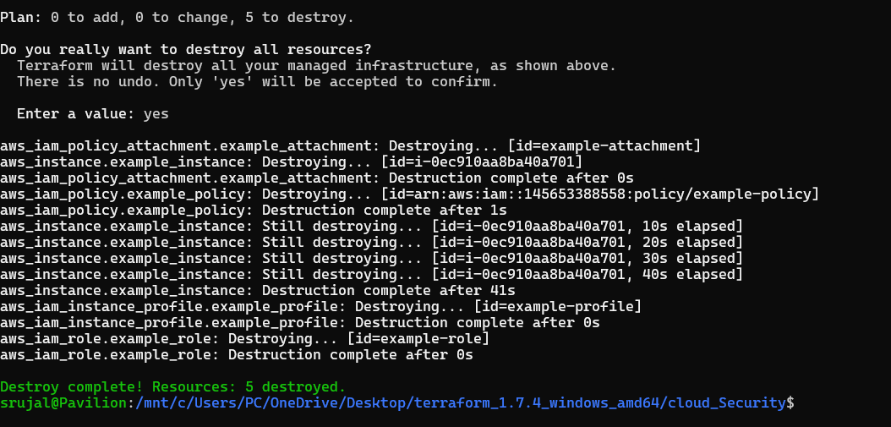

##############################################################################
# Terraform AWS IAM Role and Policy Management
##############################################################################

## Introduction

This Terraform script automates the management of AWS IAM roles and policies. It creates an IAM role, associates granular policies with the role, creates AWS resources using the role, and then disassociates and removes the role.

## Usage

### Prerequisites

Before running this Terraform script, ensure you have the following prerequisites set up:

- [Terraform](https://www.terraform.io/downloads.html) installed on your local machine.
- AWS credentials configured on your machine with necessary permissions for IAM role and policy management.

### Instructions

1. **Clone the Repository**

   Clone this repository to your local machine:

   ```bash
   git clone https://github.com/your_username/terraform-aws-iam-role-policy.git
   cd terraform-aws-iam-role-policy






